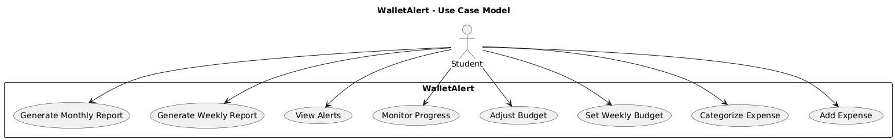
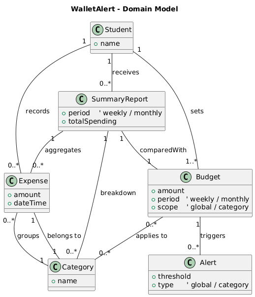
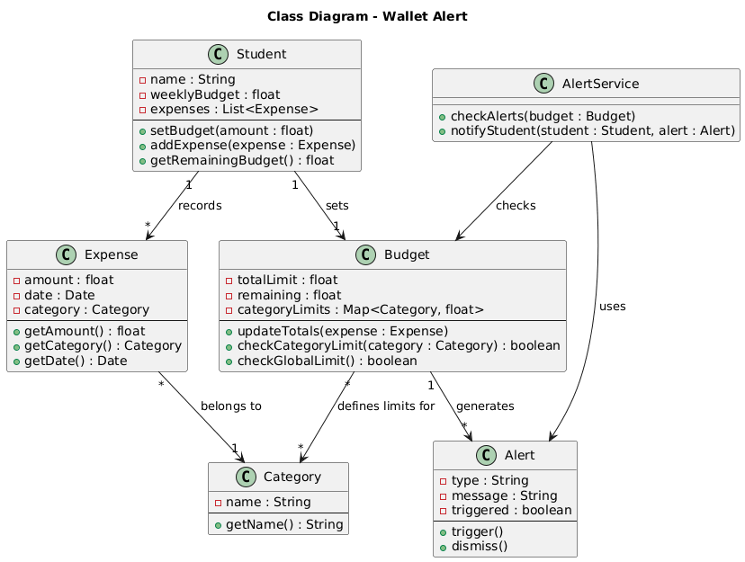
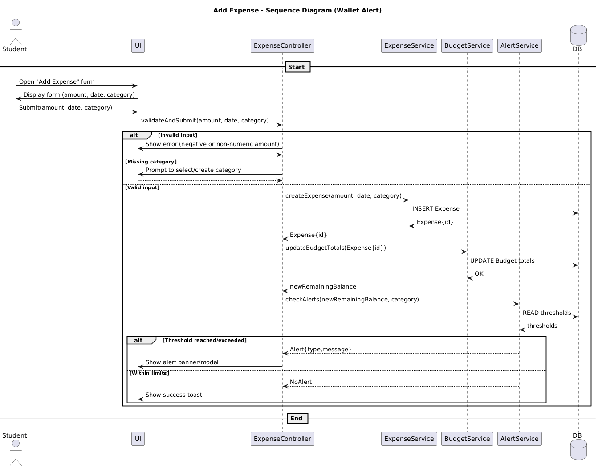

# WalletAlert

WalletAlert is a full-stack budgeting companion built for students who want a fast, no-fuss way to stay on top of spending. It pairs a React dashboard with an Express API so you can set weekly and category budgets, quickly log expenses by amount/date/category, monitor trends with clear charts, and get proactive Auth0-secured alerts as you near or exceed limits. Data lives in MongoDB, works locally or on Render, and focuses on essentials (no banking integrations) to keep tracking simple and stress-free.

## Technologies Used

- **Frontend**: React, Vite, Recharts for data visualization
- **Backend**: Node.js, Express
- **Database**: MongoDB for persistent data storage
- **Authentication**: Auth0 for secure user authentication and authorization
- **Deployment**: Render for hosting both API and web applications
- **Testing**: Vitest for unit testing

## Getting Started
- Prerequisites: Node.js 18+ and npm.
- Clone the repo, then work from the `walletalert` directory for app code.

### API (apps/api)
1) `cd walletalert/apps/api`
2) `cp .env.example .env` and fill Auth0 + MongoDB values (`AUTH0_AUDIENCE`, `AUTH0_ISSUER_BASE_URL`, `MONGO_URI` or `MONGO_USER/MONGO_PASSWORD/MONGO_HOST`, `WEB_ORIGIN`, `PORT`).
3) `npm install`
4) `npm run dev` (nodemon) or `npm start`

### Web (apps/web)
1) `cd walletalert/apps/web`
2) `cp .env.example .env` and set `VITE_API_BASE_URL`, `VITE_AUTH0_DOMAIN`, `VITE_AUTH0_CLIENT_ID`, `VITE_AUTH0_AUDIENCE`.
3) `npm install`
4) `npm run dev` (Vite dev server) or `npm run build && npm run serve`

## Code Organization
- `walletalert/apps/api`: Express server, Auth0 middleware, Mongo integration, and REST routes for budgets, transactions, categories, and bootstrap.
- `walletalert/apps/web`: React SPA (Auth0, Axios, Recharts) with dashboards, charts, and forms.
- `doc/api.md` and `doc/web.md`: Function-level documentation for the API and web layers.
- `diagrams/`: PlantUML sources (e.g., `diagrams/class-diagram.puml`) and consolidated text (`WalletAlert_All_In_Order.txt`) for UML artifacts.
- `unit-test/`: Separate testing sandbox (see its package.json for tasks).

## UML Class Diagram
- The latest UML sources live in `diagrams/class-diagram.puml` (PlantUML). Generate visuals with any PlantUML renderer.

## Key Diagrams

  

  

  

  

## Notes
- In development, the API falls back to in-memory stores when MongoDB is not configured, enabling quick local runs.
- The web app will show a helpful message if Auth0 env vars are missing instead of failing silently.
